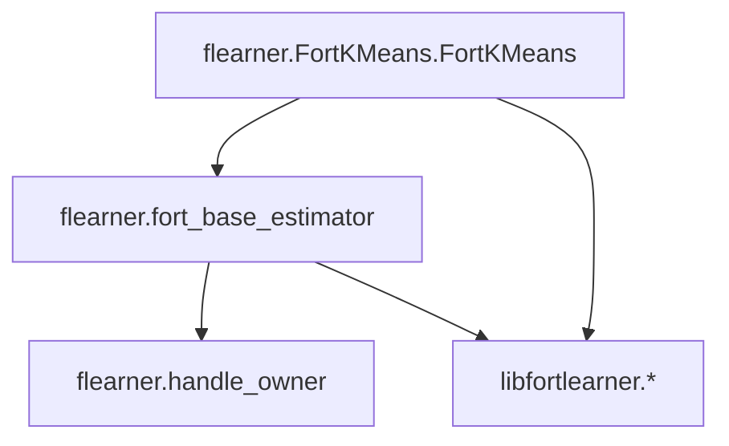
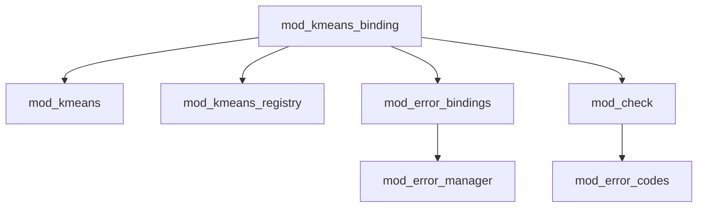

# 依存/呼び出し関係マップ

本資料は Python 層と Fortran 層の高レベル依存関係を示します。

## Python レイヤ（概念図）

要点:
- `FortKMeans` は内部的に `FortBaseEstimator` を継承し、`HandleOwner` でネイティブハンドルの生存期間を管理。
- 共有ライブラリ `libfortlearner.*` に対して ctypes 経由で呼び出し。

## Fortran レイヤ（概念図）

要点:
- Python から呼ぶ C バインディングは `mod_kmeans_binding` に集約。
- エラーは `mod_error_bindings` → `mod_error_manager` による共有バッファで受け渡し。
- 値検証は `mod_check` が担い、`mod_error_codes` の共通コードを使用。

機械可読の隣接リストは `docs/ai/deps_map.json` を参照。

